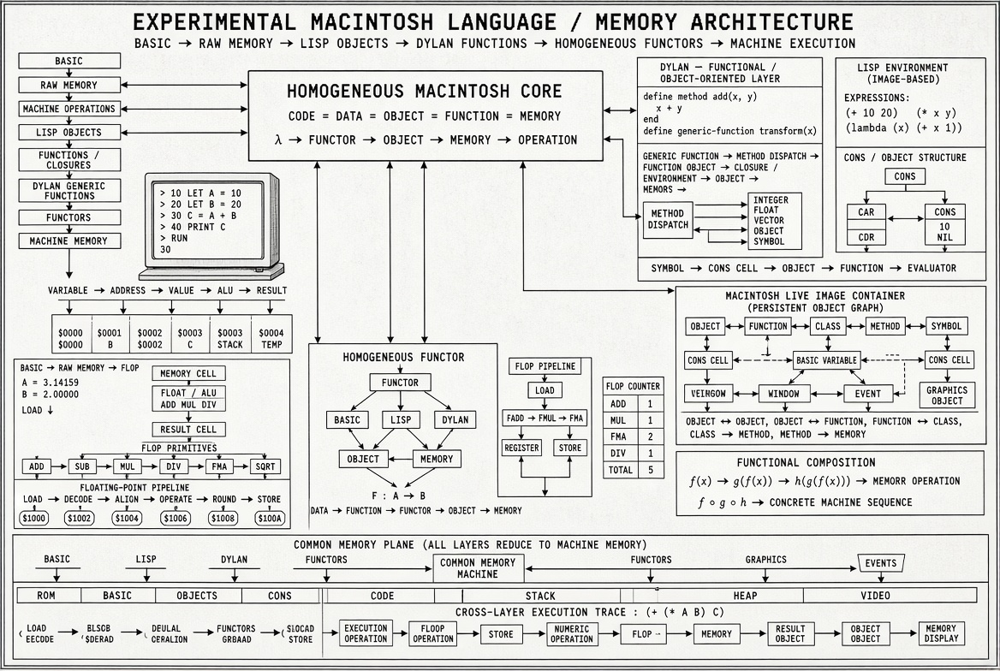

# Experimental Macintosh Homogeneous Substrate

**CODE = DATA = OBJECT = FUNCTION = MEMORY**

A ground-up reconstruction of the Macintosh computing heritage as a unified homogeneous substrate — from raw memory cells through a FLOP engine, through Smalltalk/Objective-C/Self object runtimes, through a JIT compiler with SSA and register allocation, to CUDA sparse matrix kernels.

---

## Architecture Diagram



*BASIC → RAW MEMORY → LISP OBJECTS → DYLAN FUNCTIONS → HOMOGENEOUS FUNCTORS → MACHINE EXECUTION*

---

## Authorship

**Ahmad Ali Parr wrote the C source by hand.** No AI-assisted generation was used for the C core, the GC, the JIT, or the compiler. These are Ahmad's own implementations.

The parallel 6502×x86 bare-metal assembly workflow in the sibling repo (`apple-6502x86`) was orchestrated using **Claude Haiku** (30 agents, 53 minutes, 32,606 LOC assembly). Different tool, different author relationship — documented here for clarity.

---

## Architecture

```
BASIC (memory-cell substrate)
    |
Common Lisp (cons-cell object machine)
    |
Dylan (generic functions + dispatch)
    |
C Core: Homogeneous Memory Plane
    |
+-- Smalltalk / Objective-C Dual Runtime
+-- Self Prototype System (clones, maps, parent slots)
+-- Method Caches (global + inline polymorphic)
+-- Image Persistence (full Smalltalk-style snapshot)
    |
+-- Generational GC (Cheney scavenger + become: + card table)
+-- Concurrent Old-Space Marker (tri-colour, incremental)
+-- Write Barriers (generational + store barrier)
    |
+-- JIT Back-End (x86-64 + ARM64)
+-- Inline-Cache Stubs (GC-cooperative)
+-- Portable IR (SSA form, CFG, dominators, phi-insertion)
+-- Linear-Scan Register Allocator (Woz work-stealing variant)
+-- Deoptimization + OSR
+-- Self Bytecode Compiler
    |
CUDA Sparse Matrix Layer
+-- CSR SpMV (warp-centric)
+-- ELLPACK SpMV (column-major, fully coalesced)
+-- COO format + CSR<->COO conversion
+-- Hybrid CSR/ELL (automatic format selection)
+-- SpGEMM: Gustavson hash, Two-phase, ESC, CUDA device
```

---

## Repository Layout

```
basic/          Experimental BASIC stack (memory-cell substrate)
lisp/           Common Lisp object machine (cons cells as memory)
dylan/          Dylan functional / generic-function layer
c/
  core.c        FLOP engine, unified memory plane, basic dual OO runtime
  runtime.c     Full ST/ObjC/Self runtime with method caches + image
  gc/
    gc.c        become: (two-way), memory spaces, Cheney scavenger
    barriers.c  Write barriers, bulk become, incremental GC
    concurrent.c Card table, concurrent old-space marking
  jit/
    ic.c        IC stubs, escape analysis, stack allocation, image segments
    x86_64.c    x86-64 JIT back-end (executable pages, full emitter)
  compiler/
    ir.c        Portable IR (linear IR, virtual registers)
    ssa.c       SSA construction (phi-insertion + variable renaming)
    dom_tree.c  Dominance tree traversal
    alloc.c     Linear-scan register allocator + Woz work-stealing variant
    deopt.c     Deoptimization + on-stack replacement
    backend.c   ARM64 back-end + Self bytecode compiler
cuda/
  csr.cu        CSR format + warp-centric SpMV
  ell.cu        ELLPACK format + high-bandwidth SpMV
  coo.cu        COO format + CSR<->COO conversion
  hybrid.cu     Hybrid CSR/ELL with automatic format selection
  spgemm.cu     Gustavson hash + Two-phase + ESC SpGEMM (host + device)
docs/
  sparse_algorithms.md  Algorithm survey: SpMV + SpGEMM
```

---

## The Homogeneous Principle

Every layer of this stack uses the same substrate: a flat array of typed cells that can hold integers, floats, pointers, and code. The BASIC layer calls it `MEM()`. The Lisp layer calls it cons cells. The C core calls it `memory[]`. The GC calls them heap objects. The CUDA layer calls them CSR values.

The message that every runtime sends eventually reduces to `flop_fma_op` writing a float into a shared `memory[]` cell. That is the invariant.

---

## Build

```bash
# C + JIT (requires GCC or Clang)
make c

# CUDA sparse kernels (requires nvcc + CUDA 11+)
make cuda

# All
make all
```

---

## Performance Notes

### SpMV
- CSR warp-centric: one warp per row, shuffle reduction — best for irregular matrices
- ELLPACK: column-major layout, perfectly coalesced — best for regular matrices
- Hybrid: auto-selects based on max/avg row-length ratio

### SpGEMM
- Gustavson hash: O(flops) with open-addressing, good for moderate density
- Two-phase: exact nnz allocation (symbolic + numeric) — zero wasted memory
- ESC: embarrassingly parallel — expand all products, sort, compress
- CUDA device: per-row global-memory hash tables, prefix sum via host, two-kernel dispatch

---

## License

FSL-1.1 (Functional Source License). Converts to Apache 2.0 after two years.
Copyright (c) 2026 SnapKittyWest. Ahmad Ali Parr, Bel Esprit D'Accord Irrevocable Trust.
